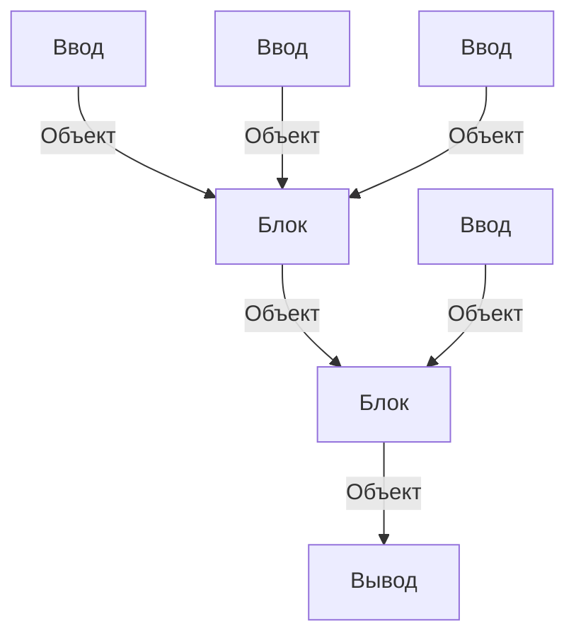

# Система работы Пайплайна
Пайплайн состит из блоков, блоки же обрабатывают обьекты

```mermaid
flowchart TD

    A1[Ввод] -->|Объект| B
    A2[Ввод] -->|Объект| B
    A3[Ввод] -->|Объект| B

    B[Блок] --> |Объект|C

    B1[Ввод] -->|Объект| C

    C[Блок] -->|Объект| D
    D[Вывод]
```