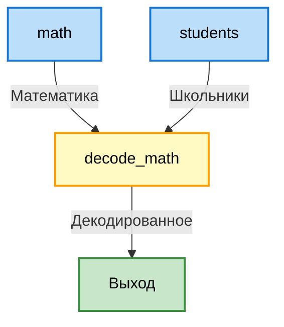

# Система работы Пайплайна
Пайплайн состит из блоков, блоки же обрабатывают обьекты

частный пример:
<table>
<tr>
<td valign="top">

**Математика**
| student | res |
|---------|-----|
| 1       | 5   |
| 2       | 27  |
| 123     | 10  |

</td>
<td valign="top">

**Школьники**
| id   | name  |
|------|-------|
| 1    | Slava |
| 2    | Dima  |
| 3    | Dan   |

</td>
<td valign="top">

**Декодированное**
| name  | score |
|-------|-------|
| Slava | 5     |
| Dima  | 27    |

</td>
</tr>
</table>



<details>
<summary>файл пайплайна</summary>


```yaml
math:
  type: db_read
  callback: in_test_read_math
  output:
    type: table
    columns:
      student: int
      res: int
students:
  type: db_read
  callback: in_test_read_students
  output:
    type: table
    columns:
      id: int
      name: str
decode_math:
  type: func
  callback: in_test_decode_math
  input:
    - math
    - students
  output:
    type: table
    columns:
      name: str
      score: int
```
</details>
<details>
<summary>Код</summary>

```python
from pipeline import NodeExecutor, Object, Row, Table
from utils import read_from_yaml_file

node_executor = NodeExecutor.from_raw_cfg(read_from_yaml_file("pipeline.yaml"))

@NodeExecutor.callback
def in_test_read_math(inp):
    table = Table()
    table.append(Row(student=1, res=5))
    table.append(Row(student=2, res=27))
    table.append(Row(student=123, res=10))
    return table

@NodeExecutor.callback
def in_test_read_students(inp):
    table = Table()
    table.append(Row(id=1, name="Slava"))
    table.append(Row(id=2, name="Dima"))
    table.append(Row(id=3, name="Dan"))
    return table

@NodeExecutor.callback
def in_test_decode_math(inp):
    decode = {stud.id: stud.name for stud in inp.students}
    table = Table()
    for res in inp.math: 
        name = decode.get(res.student)
        if name is not None:
            table.append(Row(name=decode[res.student], score=res.res)) 
    return table

res = node_executor.run("decode_math")
print(res)
```
</details>

todo: полноценное описание