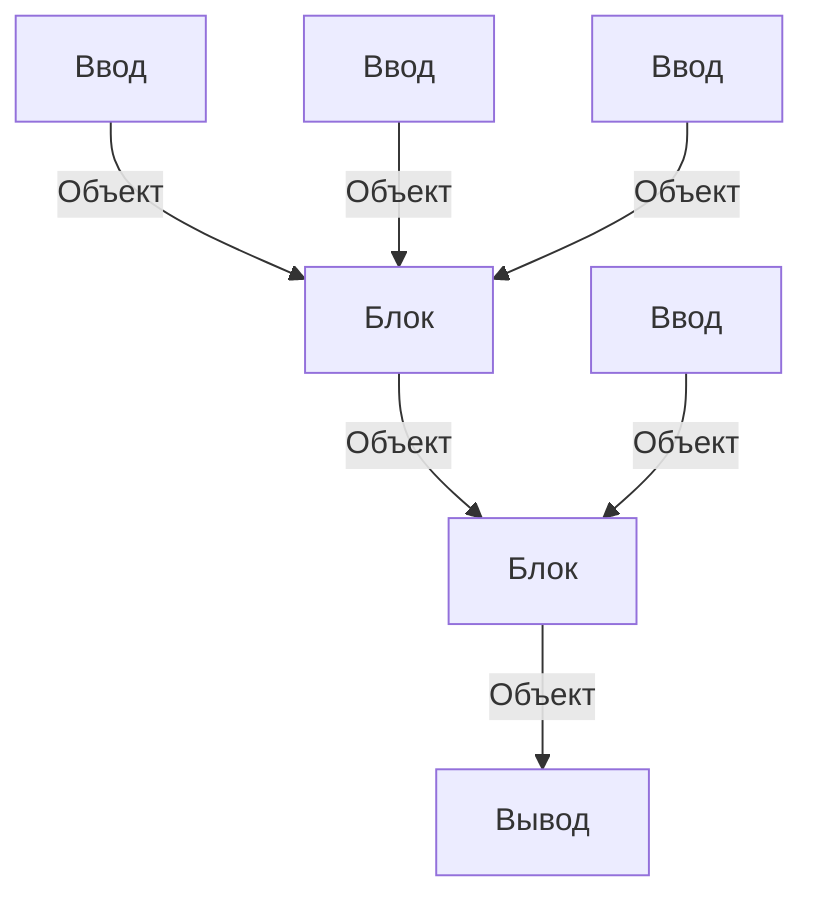
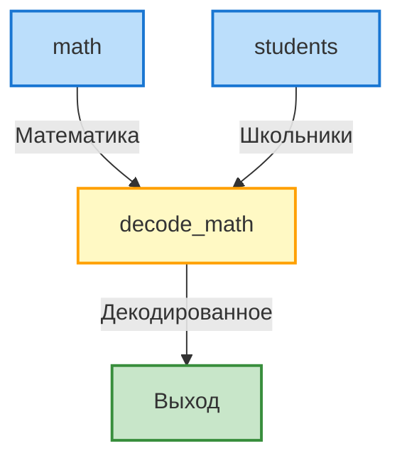

# Система работы Пайплайна
Пайплайн состит из блоков, блоки же обрабатывают обьекты



## Пример

<table>
<tr>
<td valign="top">

**Математика**
| student | res |
|---------|-----|
| 1       | 5   |
| 2       | 27  |
| 123     | 10  |

</td>
<td valign="top">

**Школьники**
| id   | name  |
|------|-------|
| 1    | Slava |
| 2    | Dima  |
| 3    | Dan   |

</td>
<td valign="top">

**Декодированное**
| name  | score |
|-------|-------|
| Slava | 5     |
| Dima  | 27    |

</td>
</tr>
</table>



<details>
<summary>Yaml описание</summary>

```yaml
math:
  type: db_read
  callback: in_test_read_math
  output:
    type: table
    columns:
      student: int
      res: int
students:
  type: db_read
  callback: in_test_read_students
  output:
    type: table
    columns:
      id: int
      name: str
decode_math:
  type: agg
  callback: in_test_decode_math
  input:
    - math
    - students
  output:
    type: table
    columns:
      name: str
      score: int
```
</details>
