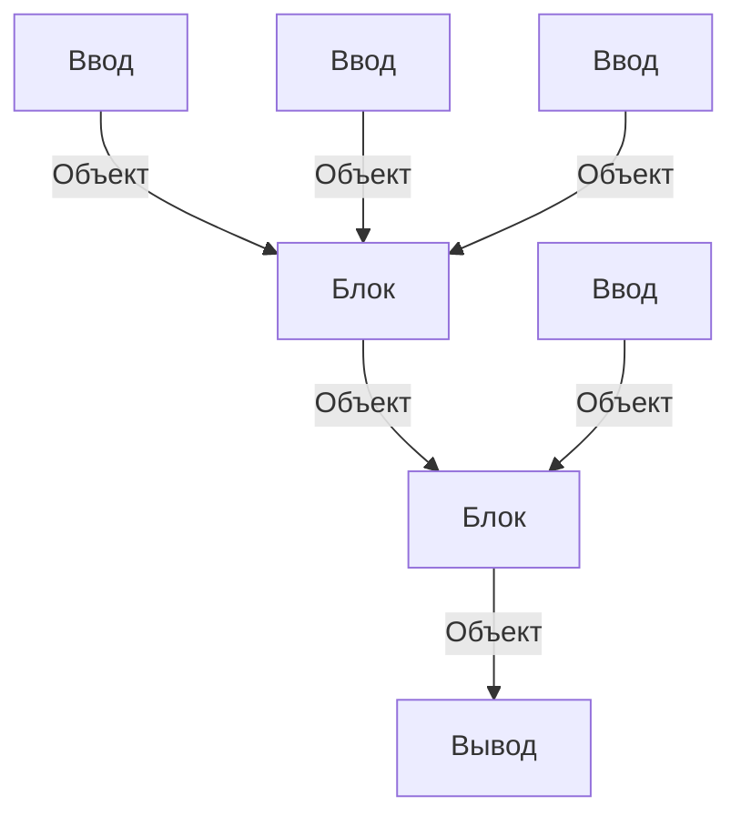

Здесь размещён FastApi бекенд для сайта.

# Структура
* [`docs`](./docs) - основа для автогенерации sphinx документации
* [`pages`](./pages) - FastApi обработчики возвращающие html страницы
* [`ratings`](./ratings) - генерация рейтингов из сырых результатов
* [`tests`](./tests) - тесты на все части сайта
* [`utils`](./utils) - разные утилиты для удобства

# Система работы Пайплайна
Пайплайн состит из блоков, блоки же обрабатывают обьекты

